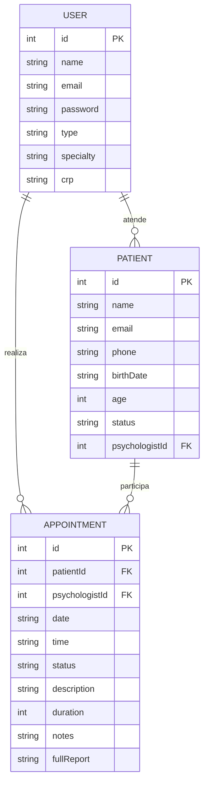

# 🧠 Lunysse - Sistema de Agendamento Psicológico

Sistema web moderno para gestão de consultas psicológicas, desenvolvido com React + Vite, focado em atendimentos voluntários em universidades, ONGs e projetos sociais.


## 📋 Índice

- [Sobre o Projeto](#sobre-o-projeto)
- [Funcionalidades](#funcionalidades)
- [Tecnologias](#tecnologias)
- [Instalação](#instalação)
- [Uso](#uso)
- [Estrutura do Projeto](#estrutura-do-projeto)
- [Modelo de Dados](#modelo-de-dados)
- [API Mock](#api-mock)
- [Chat com IA](#chat-com-ia)
- [Componentes](#componentes)
- [Rotas](#rotas)
- [Design System](#design-system)
- [Contribuição](#contribuição)
- [Licença](#licença)

## 🎯 Sobre o Projeto

O **Lunysse** é uma plataforma web desenvolvida para facilitar o agendamento e gestão de consultas psicológicas em ambientes de atendimento voluntário. O sistema oferece interfaces diferenciadas para psicólogos e pacientes, com foco na experiência do usuário e eficiência operacional.

### Objetivos

- Simplificar o processo de agendamento de consultas
- Facilitar a gestão de pacientes para psicólogos
- Fornecer relatórios e analytics para acompanhamento
- Manter histórico completo de sessões
- Garantir interface moderna e responsiva

## ✨ Funcionalidades

### 👨‍⚕️ Para Psicólogos

- **Dashboard Personalizado**: Visão geral com KPIs e próximos agendamentos
- **Gestão de Pacientes**: Lista completa com informações detalhadas
- **Detalhes do Paciente**: Histórico de sessões, anotações e relatórios
- **Gestão de Sessões**: Edição de status, anotações e relatórios clínicos
- **Chat com IA**: Assistente especializada em psicologia clínica
- **Relatórios e Analytics**: Gráficos de frequência, status e alertas de risco
- **Agenda Individual**: Controle de disponibilidade por psicólogo

### 👤 Para Pacientes

- **Dashboard Simples**: Próximos agendamentos e informações relevantes
- **Agendamento Flexível**: Escolha de psicólogo, data e horário
- **Seleção de Especialista**: Lista de psicólogos com especialidades
- **Verificação de Disponibilidade**: Horários livres em tempo real

### 🔐 Sistema de Autenticação

- Login seguro com validação
- Diferenciação automática de perfis (psicólogo/paciente)
- Tela de login moderna com glassmorphism
- Registro de novos usuários

## 🛠 Tecnologias

### Frontend
- **React 18** - Biblioteca principal
- **Vite** - Build tool e dev server
- **React Router DOM** - Roteamento
- **Tailwind CSS v4** - Framework CSS
- **Framer Motion** - Animações
- **Lucide React** - Ícones
- **Recharts** - Gráficos e visualizações
- **React Hot Toast** - Notificações
- **@huggingface/inference** - Integração com IA

### Persistência
- **LocalStorage** - Armazenamento local dos dados
- **Mock API** - Simulação de backend

### Design
- **Glassmorphism** - Efeitos visuais modernos
- **Design System** - Paleta de cores consistente
- **Responsivo** - Mobile-first approach

## 🚀 Instalação

### Pré-requisitos

- Node.js 18+ 
- npm ou yarn

### Passos

1. **Clone o repositório**
```bash
git clone https://github.com/seu-usuario/sistema-agendamento-psicologico.git
cd sistema-agendamento-psicologico
```

2. **Instale as dependências**
```bash
npm install
# ou
yarn install
```

3. **Configure as variáveis de ambiente**
```bash
cp .env.example .env
# Edite o arquivo .env e adicione seu token do Hugging Face
```

4. **Execute o projeto**
```bash
npm run dev
# ou
yarn dev
```

5. **Acesse no navegador**
```
http://localhost:5173
```

## 💻 Uso

### Contas de Teste

#### Psicólogos
- **Dr. João Silva**: `psicologo@test.com` / `123456` - Psicologia Clínica
- **Dra. Ana Costa**: `ana@test.com` / `123456` - Terapia Cognitivo-Comportamental
- **Dr. Carlos Mendes**: `carlos@test.com` / `123456` - Psicologia Infantil
- **Dra. Lucia Ferreira**: `lucia@test.com` / `123456` - Terapia Familiar

#### Paciente
- **Maria Santos**: `paciente@test.com` / `123456`

### Fluxo de Uso

1. **Login**: Acesse com uma das contas de teste
2. **Dashboard**: Visualize informações relevantes ao seu perfil
3. **Navegação**: Use a sidebar para acessar diferentes seções
4. **Agendamento** (Pacientes): Escolha psicólogo, data e horário
5. **Gestão** (Psicólogos): Gerencie pacientes e sessões

## 📁 Estrutura do Projeto

```
src/
├── components/          # Componentes reutilizáveis
│   ├── Button.jsx      # Botão customizado
│   ├── Card.jsx        # Container com glassmorphism
│   ├── LoadingSpinner.jsx
│   ├── MarkdownRenderer.jsx # Renderizador de markdown
│   ├── Modal.jsx       # Modal responsivo
│   ├── PublicNavbar.jsx # Navbar para páginas públicas
│   └── Sidebar.jsx     # Sidebar para usuários autenticados
├── context/            # Contextos React
│   └── AuthContext.jsx # Contexto de autenticação
├── pages/              # Páginas da aplicação
│   ├── About.jsx       # Página sobre
│   ├── Agendamento.jsx # Agendamento de consultas
│   ├── ChatIA.jsx      # Chat com IA especializada
│   ├── DashboardPaciente.jsx
│   ├── DashboardPsicologo.jsx
│   ├── Home.jsx        # Página inicial
│   ├── Login.jsx       # Login padrão
│   ├── LunysseLogin.jsx # Login moderno
│   ├── NotFound.jsx    # Página 404
│   ├── PacienteDetalhes.jsx
│   ├── Pacientes.jsx   # Lista de pacientes
│   ├── Register.jsx    # Cadastro
│   ├── Relatorios.jsx  # Relatórios e analytics
│   └── SessaoDetalhes.jsx
├── routes/             # Configuração de rotas
│   └── AppRoutes.jsx   # Rotas principais
├── services/           # Serviços e APIs
│   ├── aiService.js    # Serviço de IA
│   └── mockApi.js      # API mockada
├── App.jsx             # Componente principal
├── index.css           # Estilos globais Tailwind
└── main.jsx            # Entry point
```

## 🗄 Modelo de Dados

### Entidades Principais

#### User (Usuário)
```javascript
{
  id: number,
  name: string,
  email: string,
  password: string,
  type: 'psicologo' | 'paciente',
  // Campos específicos para psicólogos
  specialty?: string,
  crp?: string
}
```

#### Patient (Paciente)
```javascript
{
  id: number,
  name: string,
  email: string,
  phone: string,
  birthDate: string,
  age: number,
  status: string,
  psychologistId: number, // FK para User
  totalSessions?: number  // Calculado dinamicamente
}
```

#### Appointment (Agendamento/Sessão)
```javascript
{
  id: number,
  patientId: number,      // FK para Patient
  psychologistId: number, // FK para User
  date: string,           // YYYY-MM-DD
  time: string,           // HH:MM
  status: 'agendado' | 'concluido' | 'cancelado' | 'reagendado',
  description: string,
  duration: number,       // minutos
  notes: string,          // Anotações da sessão
  fullReport: string      // Relatório completo
}
```

### Relacionamentos

```
User (Psicólogo) 1:N Patient
User (Psicólogo) 1:N Appointment
Patient 1:N Appointment
```

### Diagrama ER



## 🔌 API Mock

### Estrutura da API

A API mockada simula um backend real com as seguintes funcionalidades:

#### Autenticação
- `login(email, password)` - Autenticação de usuário
- `register(userData)` - Registro de novo usuário

#### Usuários
- `getPsychologists()` - Lista psicólogos disponíveis

#### Pacientes
- `getPatients(psychologistId)` - Lista pacientes do psicólogo

#### Agendamentos
- `getAppointments(userId, userType)` - Lista agendamentos
- `createAppointment(appointmentData)` - Criar agendamento
- `getAvailableSlots(date, psychologistId)` - Horários disponíveis
- `updateAppointment(id, data)` - Atualizar agendamento
- `cancelAppointment(id)` - Cancelar agendamento

#### Sessões
- `getSessionDetails(sessionId)` - Detalhes da sessão
- `updateSessionStatus(sessionId, status)` - Atualizar status
- `updateSessionNotes(sessionId, notes, report)` - Atualizar anotações

#### Relatórios
- `getReportsData(psychologistId)` - Dados para relatórios

### Persistência

Os dados são armazenados no `localStorage` do navegador:

- `lunysse_users` - Usuários do sistema
- `lunysse_patients` - Pacientes cadastrados
- `lunysse_appointments` - Agendamentos e sessões

## 🤖 Chat com IA

### Funcionalidades

- **Assistente Especializada**: IA treinada em psicologia clínica
- **Respostas Estruturadas**: Formatação markdown para melhor legibilidade
- **Histórico de Conversa**: Contexto mantido durante a sessão
- **Tratamento de Erros**: Mensagens informativas para problemas de conexão
- **Interface Moderna**: Design consistente com o sistema

### Configuração

1. **Obtenha um token do Hugging Face**:
   - Acesse [huggingface.co](https://huggingface.co)
   - Crie uma conta e gere um token de API

2. **Configure o arquivo .env**:
   ```bash
   VITE_HF_TOKEN=seu_token_aqui
   ```

3. **Modelo Utilizado**:
   - **Provider**: Novita
   - **Modelo**: zai-org/GLM-4.5
   - **Especialização**: Psicologia clínica

### Exemplos de Uso

- "Como lidar com pacientes com ansiedade?"
- "Técnicas para terapia infantil"
- "Abordagens para terapia de casal"
- "Sinais de alerta em depressão"
- "Orientações sobre aspectos éticos"

### Componentes

#### `ChatIA.jsx`
- Interface principal do chat
- Gerenciamento de mensagens e estado
- Integração com o serviço de IA

#### `MarkdownRenderer.jsx`
- Renderização de markdown nas respostas
- Formatação de títulos, listas e código
- Estilos consistentes com o design system

#### `aiService.js`
- Integração com Hugging Face Inference API
- Tratamento de erros e timeouts
- Configuração de parâmetros do modelo

## 🎨 Design System

### Paleta de Cores

```css
:root {
  --dark: #010440;      /* Azul escuro principal */
  --medium: #024873;    /* Azul médio */
  --light: #2493BF;     /* Azul claro */
  --accent: #26B0BF;    /* Azul accent */
  --background: #F2EFE9; /* Bege claro */
}
```

### Tipografia

- **Primária**: Inter (títulos e interface)
- **Secundária**: Nunito (textos corridos)
- **Monospace**: Roboto Mono (códigos)

### Componentes Base

#### Button
- Variantes: primary, secondary, danger
- Estados: normal, hover, loading, disabled
- Tamanhos: sm, md, lg

#### Card
- Glassmorphism effect
- Sombras suaves
- Bordas arredondadas

#### Modal
- Overlay com blur
- Animações de entrada/saída
- Responsivo

### Breakpoints

```css
sm: 640px
md: 768px
lg: 1024px
xl: 1280px
2xl: 1536px
```

## 🧩 Componentes

### Componentes de UI

#### `<Button />`
Botão customizado com variantes e estados.

```jsx
<Button variant="primary" size="lg" loading={isLoading}>
  Confirmar
</Button>
```

#### `<Card />`
Container com efeito glassmorphism.

```jsx
<Card className="p-6">
  <h2>Título do Card</h2>
  <p>Conteúdo...</p>
</Card>
```

#### `<Modal />`
Modal responsivo com overlay.

```jsx
<Modal isOpen={isOpen} onClose={handleClose} title="Título">
  <p>Conteúdo do modal...</p>
</Modal>
```

#### `<MarkdownRenderer />`
Renderizador de markdown para mensagens da IA.

```jsx
<MarkdownRenderer content={markdownText} />
```

### Componentes de Layout

#### `<Sidebar />`
Navegação lateral para usuários autenticados.

#### `<PublicNavbar />`
Navbar para páginas públicas.

### Componentes de Utilidade

#### `<LoadingSpinner />`
Indicador de carregamento com tamanhos variados.

## 🛣 Rotas

### Rotas Públicas
- `/` - Página inicial
- `/about` - Sobre o projeto
- `/login` - Login padrão
- `/lunysse` - Login moderno
- `/register` - Cadastro

### Rotas Protegidas
- `/dashboard` - Dashboard (redireciona por tipo de usuário)
- `/agendamento` - Agendamento (apenas pacientes)
- `/pacientes` - Lista de pacientes (apenas psicólogos)
- `/pacientes/:id` - Detalhes do paciente
- `/sessao/:sessionId` - Detalhes da sessão
- `/chat-ia` - Chat com IA (apenas psicólogos)
- `/relatorios` - Relatórios (apenas psicólogos)

### Proteção de Rotas

```jsx
const ProtectedRoute = ({ children }) => {
  const { user, loading } = useAuth();
  
  if (loading) return <LoadingSpinner />;
  if (!user) return <Navigate to="/login" />;
  
  return (
    <div className="min-h-screen flex">
      <Sidebar />
      <main className="flex-1 lg:ml-64 p-8">
        {children}
      </main>
    </div>
  );
};
```

## 📊 Funcionalidades Avançadas

### Sistema de Relatórios

- **KPIs Dinâmicos**: Calculados em tempo real
- **Gráficos Interativos**: Recharts para visualizações
- **Alertas de Risco**: Baseados em padrões de comportamento
- **Dados Históricos**: Análise temporal de sessões

### Chat com IA Especializada

- **Assistente Inteligente**: IA especializada em psicologia clínica
- **Respostas Estruturadas**: Formatação markdown automática
- **Contexto Mantido**: Histórico de conversa preservado
- **Sugestões Inteligentes**: Perguntas pré-definidas para facilitar uso
- **Tratamento de Erros**: Feedback claro sobre problemas de conexão

### Gestão de Agenda

- **Disponibilidade Individual**: Cada psicólogo tem sua agenda
- **Conflito de Horários**: Prevenção automática
- **Horários Flexíveis**: Configuração de slots disponíveis
- **Status de Sessões**: Controle completo do ciclo de vida

### Interface Responsiva

- **Mobile-First**: Design otimizado para dispositivos móveis
- **Sidebar Adaptativa**: Menu hambúrguer em telas pequenas
- **Cards Flexíveis**: Layout que se adapta ao conteúdo
- **Navegação Intuitiva**: UX consistente em todos os dispositivos

## 🔧 Scripts Disponíveis

```bash
# Desenvolvimento
npm run dev

# Build para produção
npm run build

# Preview da build
npm run preview

# Lint do código
npm run lint

# Instalar dependências
npm install

# Instalar dependência da IA
npm install @huggingface/inference
```

## 🤝 Contribuição

1. Fork o projeto
2. Crie uma branch para sua feature (`git checkout -b feature/AmazingFeature`)
3. Commit suas mudanças (`git commit -m 'Add some AmazingFeature'`)
4. Push para a branch (`git push origin feature/AmazingFeature`)
5. Abra um Pull Request

### Padrões de Código

- Use ESLint para manter consistência
- Siga os padrões do Prettier
- Componentes em PascalCase
- Funções em camelCase
- Constantes em UPPER_CASE

## 📝 Licença

Este projeto está sob a licença MIT. Veja o arquivo [LICENSE](LICENSE) para mais detalhes.

## 👥 Equipe

- **Desenvolvedor Principal**: [Seu Nome]
- **Design**: [Nome do Designer]
- **Consultoria Psicológica**: [Nome do Consultor]

## 📞 Contato

- **Email**: contato@lunysse.com
- **Website**: https://lunysse.com
- **GitHub**: https://github.com/seu-usuario/sistema-agendamento-psicologico

---

<div align="center">
  <p>Desenvolvido com ❤️ para facilitar o acesso à saúde mental</p>
  <p><strong>Lunysse - Sistema de Agendamento Psicológico</strong></p>
</div>