# 📅 Cronograma Visual - Curso Lunysse Full Stack

## 🎯 Visão Geral do Curso (27 Aulas - 108h)

```mermaid
gantt
    title Cronograma do Curso Lunysse Full Stack
    dateFormat  X
    axisFormat %d

    section Parte 1 - Fundamentos Visuais
    Imagem Digital           :a1, 0, 1d
    Comunicação Visual       :a2, after a1, 1d
    Componentes Visuais      :a3, after a2, 1d
    Tratamento de Imagens    :a4, after a3, 1d
    Design Responsivo        :a5, after a4, 1d

    section Parte 2 - Linguagens Web
    HTML Semântico          :b1, after a5, 1d
    CSS e Tailwind          :b2, after b1, 1d
    Layout Responsivo       :b3, after b2, 1d
    JavaScript Básico       :b4, after b3, 1d
    Eventos e DOM           :b5, after b4, 1d
    Testes e Compatibilidade :b6, after b5, 1d

    section Parte 3 - Programação Avançada
    Animações Web           :c1, after b6, 1d
    Comunicação Avançada    :c2, after c1, 1d
    Efeitos Visuais         :c3, after c2, 1d
    Responsivo Avançado     :c4, after c3, 1d
    SEO e Semântica         :c5, after c4, 1d
    JavaScript OO           :c6, after c5, 1d
    DOM Avançado            :c7, after c6, 1d
    Debugging               :c8, after c7, 1d
    SQL e APIs              :c9, after c8, 1d
    Testes Avançados        :c10, after c9, 1d
    Git e Colaboração       :c11, after c10, 1d
    Desenvolvimento Final   :c12, after c11, 3d
    Documentação            :c13, after c12, 1d
    Deploy e Apresentação   :c14, after c13, 1d
```



---

## 📊 Distribuição de Carga Horária

### **Por Parte do Curso**
```
Parte 1 - Fundamentos Visuais: 20h (18.5%)
├── 5 aulas × 4h cada
└── Foco: Design, UX/UI, Prototipagem

Parte 2 - Linguagens Web: 24h (22.2%)
├── 6 aulas × 4h cada  
└── Foco: HTML, CSS, JavaScript básico

Parte 3 - Programação Avançada: 64h (59.3%)
├── 16 aulas × 4h cada
└── Foco: React, APIs, Projeto final
```

### **Por Tipo de Atividade**
```
Teoria: 32h (30%)
├── Conceitos fundamentais
├── Demonstrações
└── Explicações técnicas

Prática: 76h (70%)
├── Exercícios hands-on
├── Desenvolvimento do projeto
└── Testes e debugging
```

---

## 🗓 Cronograma Detalhado por Semana

### **Semana 1 - Fundamentos Visuais**
| Dia | Aula | Tópico | Duração | Entregáveis |
|-----|------|--------|---------|-------------|
| Seg | 1 | Imagem Digital | 4h | Assets otimizados |
| Ter | 2 | Comunicação Visual | 4h | Protótipo login |
| Qua | 3 | Componentes Visuais | 4h | Wireframes |
| Qui | 4 | Tratamento de Imagens | 4h | Biblioteca assets |
| Sex | 5 | Design Responsivo | 4h | Protótipos responsivos |

**Marco da Semana**: Design system completo e protótipos validados

---

### **Semana 2 - Linguagens Web Básicas**
| Dia | Aula | Tópico | Duração | Entregáveis |
|-----|------|--------|---------|-------------|
| Seg | 6 | HTML Semântico | 4h | Estrutura HTML |
| Ter | 7 | CSS e Tailwind | 4h | Componentes estilizados |
| Qua | 8 | Layout Responsivo | 4h | Sidebar responsiva |
| Qui | 9 | JavaScript Básico | 4h | Sistema validação |
| Sex | 10 | Eventos e DOM | 4h | Interações básicas |

**Marco da Semana**: Páginas estáticas funcionais com interatividade

---

### **Semana 3 - Transição para React**
| Dia | Aula | Tópico | Duração | Entregáveis |
|-----|------|--------|---------|-------------|
| Seg | 11 | Testes e Compatibilidade | 4h | Relatório qualidade |
| Ter | 12 | Migração para React | 4h | Componentes React |
| Qua | 13 | Comunicação Avançada | 4h | Design refinado |
| Qui | 14 | Efeitos Visuais | 4h | Glassmorphism |
| Sex | 15 | Responsivo Avançado | 4h | Layout completo |

**Marco da Semana**: Transição completa para React

---

### **Semana 4 - Funcionalidades Core**
| Dia | Aula | Tópico | Duração | Entregáveis |
|-----|------|--------|---------|-------------|
| Seg | 16 | SEO e Semântica | 4h | Páginas otimizadas |
| Ter | 17 | JavaScript OO | 4h | Modelos de dados |
| Qua | 18 | DOM Avançado | 4h | Interações complexas |
| Qui | 19 | Debugging | 4h | App otimizada |
| Sex | 20 | SQL e APIs | 4h | Mock API funcional |

**Marco da Semana**: Funcionalidades básicas implementadas

---

### **Semana 5 - Desenvolvimento Intensivo**
| Dia | Aula | Tópico | Duração | Entregáveis |
|-----|------|--------|---------|-------------|
| Seg | 21 | Testes Avançados | 4h | Testes implementados |
| Ter | 22 | Git e Colaboração | 4h | Repositório organizado |
| Qua | 23 | Desenvolvimento Final I | 4h | Dashboards |
| Qui | 24 | Desenvolvimento Final II | 4h | Agendamento |
| Sex | 25 | Desenvolvimento Final III | 4h | Gestão pacientes |

**Marco da Semana**: Sistema 90% funcional

---

### **Semana 6 - Finalização**
| Dia | Aula | Tópico | Duração | Entregáveis |
|-----|------|--------|---------|-------------|
| Seg | 26 | Documentação | 4h | Docs completas |
| Ter | 27 | Deploy e Apresentação | 4h | App deployada |

**Marco da Semana**: Projeto finalizado e apresentado

---

## ✅ Checklist de Progresso por Aula

### **PARTE 1 - FUNDAMENTOS VISUAIS**

#### **Aula 1 - Imagem Digital**
- [ ] **Teoria Completa**
  - [ ] Conceitos vetor vs bitmap explicados
  - [ ] Formatos PNG, JPEG, SVG, GIF demonstrados
  - [ ] Unidades de medida (px, dpi, %) abordadas
  - [ ] Taxa de bits e performance discutidos

- [ ] **Prática Realizada**
  - [ ] Logo Lunysse analisado e otimizado
  - [ ] Ícones SVG preparados para sidebar
  - [ ] Favicons criados em múltiplas resoluções
  - [ ] Assets organizados em pasta estruturada

- [ ] **Entregáveis**
  - [ ] Pasta `assets/optimized/` criada
  - [ ] Relatório de análise de formatos
  - [ ] Ícones SVG funcionais
  - [ ] Documentação de otimização

#### **Aula 2 - Comunicação Visual**
- [ ] **Teoria Completa**
  - [ ] Tipografia Inter e Nunito configuradas
  - [ ] Paleta Lunysse aplicada e testada
  - [ ] Grid system de 12 colunas explicado
  - [ ] Princípios Gestalt demonstrados

- [ ] **Prática Realizada**
  - [ ] Variáveis CSS criadas para design system
  - [ ] Protótipo de login com paleta aplicada
  - [ ] Hierarquia tipográfica definida
  - [ ] Testes de contraste realizados

- [ ] **Entregáveis**
  - [ ] Guia de estilo tipográfico
  - [ ] Protótipo validado
  - [ ] Grid system documentado
  - [ ] Paleta de cores testada

#### **Aula 3 - Componentes Visuais**
- [ ] **Teoria Completa**
  - [ ] Anatomia de componentes explicada
  - [ ] Design system conceituado
  - [ ] Estados e variações definidos
  - [ ] Padrões de reutilização estabelecidos

- [ ] **Prática Realizada**
  - [ ] Wireframes de baixa fidelidade criados
  - [ ] Componentes principais mapeados
  - [ ] Especificações técnicas definidas
  - [ ] Protótipo navegável básico

- [ ] **Entregáveis**
  - [ ] Wireframes completos
  - [ ] Especificações de componentes
  - [ ] Biblioteca de componentes planejada
  - [ ] Protótipo testado

#### **Aula 4 - Tratamento de Imagens**
- [ ] **Teoria Completa**
  - [ ] Ferramentas de edição apresentadas
  - [ ] Técnicas de otimização ensinadas
  - [ ] Formatos modernos (WebP) abordados
  - [ ] Responsive images explicadas

- [ ] **Prática Realizada**
  - [ ] Logo redimensionado para múltiplos tamanhos
  - [ ] Favicons gerados automaticamente
  - [ ] Sprites de ícones organizados
  - [ ] Pipeline de otimização criado

- [ ] **Entregáveis**
  - [ ] Assets em múltiplos formatos
  - [ ] Guia de otimização
  - [ ] Sprites funcionais
  - [ ] Workflow documentado

#### **Aula 5 - Design Responsivo**
- [ ] **Teoria Completa**
  - [ ] Mobile-first approach explicado
  - [ ] Breakpoints Tailwind apresentados
  - [ ] Progressive enhancement conceituado
  - [ ] Padrões responsivos demonstrados

- [ ] **Prática Realizada**
  - [ ] Protótipos em 3 breakpoints criados
  - [ ] Sidebar colapsável projetada
  - [ ] Grid responsivo planejado
  - [ ] Testes de usabilidade mobile

- [ ] **Entregáveis**
  - [ ] Protótipos responsivos validados
  - [ ] Especificações de comportamento
  - [ ] Testes de usabilidade documentados
  - [ ] Guia de responsividade

---

### **PARTE 2 - LINGUAGENS WEB BÁSICAS**

#### **Aula 6 - HTML Semântico**
- [ ] **Setup Completo**
  - [ ] Projeto Vite configurado
  - [ ] Estrutura de pastas criada
  - [ ] Dependências instaladas
  - [ ] Ambiente de desenvolvimento pronto

- [ ] **Teoria Completa**
  - [ ] Tags semânticas HTML5 explicadas
  - [ ] Acessibilidade básica abordada
  - [ ] ARIA patterns demonstrados
  - [ ] SEO básico conceituado

- [ ] **Prática Realizada**
  - [ ] Estrutura HTML das páginas principais
  - [ ] Navegação acessível implementada
  - [ ] Labels e roles aplicados
  - [ ] Validação W3C realizada

- [ ] **Entregáveis**
  - [ ] Páginas HTML válidas
  - [ ] Checklist de acessibilidade
  - [ ] Estrutura semântica documentada
  - [ ] Testes com screen reader

#### **Aula 7 - CSS e Tailwind**
- [ ] **Configuração**
  - [ ] Tailwind CSS instalado e configurado
  - [ ] Tema personalizado para Lunysse
  - [ ] Cores e fontes customizadas
  - [ ] Build system funcionando

- [ ] **Teoria Completa**
  - [ ] Fundamentos CSS revisados
  - [ ] Utility-first approach explicado
  - [ ] Especificidade e cascata abordadas
  - [ ] Box model demonstrado

- [ ] **Prática Realizada**
  - [ ] Componente Button implementado
  - [ ] Componente Card com glassmorphism
  - [ ] Página de login estilizada
  - [ ] Sistema de cores aplicado

- [ ] **Entregáveis**
  - [ ] Configuração Tailwind personalizada
  - [ ] Componentes básicos funcionais
  - [ ] Guia de classes utilitárias
  - [ ] Página login estilizada

#### **Aula 8 - Layout Responsivo**
- [ ] **Teoria Completa**
  - [ ] Flexbox vs Grid explicados
  - [ ] Media queries demonstradas
  - [ ] Mobile-first implementado
  - [ ] Breakpoints estratégicos definidos

- [ ] **Prática Realizada**
  - [ ] Sidebar responsiva implementada
  - [ ] Dashboard adaptativo criado
  - [ ] Menu hambúrguer funcional
  - [ ] Testes em múltiplos dispositivos

- [ ] **Entregáveis**
  - [ ] Sidebar completamente responsiva
  - [ ] Layout adaptativo funcional
  - [ ] Testes de compatibilidade
  - [ ] Documentação de breakpoints

#### **Aula 9 - JavaScript Básico**
- [ ] **Teoria Completa**
  - [ ] Sintaxe JavaScript moderna
  - [ ] Tipos de dados e variáveis
  - [ ] Estruturas de controle
  - [ ] Funções e escopo

- [ ] **Prática Realizada**
  - [ ] Sistema de validação implementado
  - [ ] Lógica de autenticação básica
  - [ ] Tratamento de erros
  - [ ] Testes unitários simples

- [ ] **Entregáveis**
  - [ ] Funções de validação
  - [ ] Sistema de autenticação
  - [ ] Testes básicos
  - [ ] Documentação de código

#### **Aula 10 - Eventos e DOM**
- [ ] **Teoria Completa**
  - [ ] Sistema de eventos explicado
  - [ ] Bubbling e capturing demonstrados
  - [ ] Manipulação DOM abordada
  - [ ] Performance considerations

- [ ] **Prática Realizada**
  - [ ] Sistema de notificações toast
  - [ ] Toggle sidebar mobile
  - [ ] Modais de confirmação
  - [ ] Feedback visual em ações

- [ ] **Entregáveis**
  - [ ] Interações básicas funcionais
  - [ ] Sistema de modais
  - [ ] Notificações implementadas
  - [ ] Feedback visual consistente

#### **Aula 11 - Testes e Compatibilidade**
- [ ] **Teoria Completa**
  - [ ] Cross-browser testing explicado
  - [ ] Métricas de performance abordadas
  - [ ] Ferramentas de teste apresentadas
  - [ ] Debugging techniques demonstradas

- [ ] **Prática Realizada**
  - [ ] Testes em múltiplos navegadores
  - [ ] Métricas Lighthouse coletadas
  - [ ] Bugs identificados e corrigidos
  - [ ] Performance otimizada

- [ ] **Entregáveis**
  - [ ] Relatório de compatibilidade
  - [ ] Métricas de performance
  - [ ] Lista de correções
  - [ ] Plano de otimização

---

### **PARTE 3 - PROGRAMAÇÃO AVANÇADA**

#### **Aula 12 - Migração para React**
- [ ] **Setup React**
  - [ ] Projeto React criado com Vite
  - [ ] Dependências instaladas
  - [ ] Estrutura de pastas organizada
  - [ ] Configuração de desenvolvimento

- [ ] **Migração Completa**
  - [ ] Componentes básicos migrados
  - [ ] Roteamento implementado
  - [ ] Context API configurado
  - [ ] Estados gerenciados

- [ ] **Entregáveis**
  - [ ] Aplicação React funcional
  - [ ] Componentes migrados
  - [ ] Roteamento básico
  - [ ] Estado global configurado

#### **Aulas 13-15 - Componentes Avançados**
- [ ] **Animações (Aula 13)**
  - [ ] Framer Motion integrado
  - [ ] Animações de entrada/saída
  - [ ] Transições suaves
  - [ ] Performance otimizada

- [ ] **Formulários (Aula 14)**
  - [ ] Hook customizado useForm
  - [ ] Validação em tempo real
  - [ ] Estados de erro
  - [ ] Feedback visual

- [ ] **Roteamento (Aula 15)**
  - [ ] React Router configurado
  - [ ] Rotas protegidas
  - [ ] Redirecionamentos
  - [ ] Navegação contextual

#### **Aulas 16-20 - Funcionalidades Core**
- [ ] **Context e Estado (Aula 16)**
  - [ ] AuthContext implementado
  - [ ] Estado global gerenciado
  - [ ] Persistência localStorage
  - [ ] Hooks customizados

- [ ] **Classes e OO (Aula 17)**
  - [ ] Modelos de dados em classes
  - [ ] Herança implementada
  - [ ] Encapsulamento aplicado
  - [ ] Testes unitários

- [ ] **Eventos Avançados (Aula 18)**
  - [ ] Custom events criados
  - [ ] Event delegation implementado
  - [ ] Performance otimizada
  - [ ] Memory leaks prevenidos

- [ ] **Debugging (Aula 19)**
  - [ ] DevTools dominado
  - [ ] Performance profiling
  - [ ] Memory analysis
  - [ ] Otimizações aplicadas

- [ ] **APIs (Aula 20)**
  - [ ] Mock API completa
  - [ ] Fetch API implementado
  - [ ] Error handling robusto
  - [ ] Loading states

#### **Aulas 21-25 - Desenvolvimento Final**
- [ ] **Testes (Aula 21)**
  - [ ] Testes de usabilidade
  - [ ] Acessibilidade validada
  - [ ] Performance medida
  - [ ] Correções implementadas

- [ ] **Git (Aula 22)**
  - [ ] Repositório organizado
  - [ ] Workflow definido
  - [ ] Documentação atualizada
  - [ ] Versionamento semântico

- [ ] **Dashboards (Aula 23)**
  - [ ] Dashboard psicólogo completo
  - [ ] Dashboard paciente funcional
  - [ ] KPIs dinâmicos
  - [ ] Gráficos interativos

- [ ] **Agendamento (Aula 24)**
  - [ ] Sistema completo
  - [ ] Validação de conflitos
  - [ ] Interface intuitiva
  - [ ] Confirmações automáticas

- [ ] **Gestão (Aula 25)**
  - [ ] Lista de pacientes
  - [ ] Detalhes completos
  - [ ] Histórico de sessões
  - [ ] Relatórios funcionais

#### **Aulas 26-27 - Finalização**
- [ ] **Documentação (Aula 26)**
  - [ ] README completo
  - [ ] Manual do usuário
  - [ ] Documentação técnica
  - [ ] Guias de instalação

- [ ] **Deploy (Aula 27)**
  - [ ] Build de produção
  - [ ] Deploy no Vercel
  - [ ] Domínio configurado
  - [ ] Apresentação realizada

---

## 📈 Métricas de Sucesso

### **Por Aula**
- [ ] **Participação**: >90% dos alunos presentes
- [ ] **Entregáveis**: >80% dos alunos entregaram
- [ ] **Qualidade**: Média >7.0 nas avaliações
- [ ] **Feedback**: >4.0/5.0 na avaliação da aula

### **Por Parte**
- [ ] **Parte 1**: Design system completo e validado
- [ ] **Parte 2**: Páginas funcionais com interatividade
- [ ] **Parte 3**: Aplicação completa e deployada

### **Final do Curso**
- [ ] **Projeto**: 100% dos alunos com projeto funcional
- [ ] **Deploy**: >90% dos projetos deployados
- [ ] **Apresentação**: Todas as apresentações realizadas
- [ ] **Satisfação**: >4.5/5.0 na avaliação geral

---

## 🎯 Marcos Importantes

### **Marco 1 - Semana 1** 
**Design System Validado**
- Protótipos aprovados
- Assets otimizados
- Paleta de cores definida
- Componentes especificados

### **Marco 2 - Semana 2**
**Páginas Estáticas Funcionais**
- HTML semântico validado
- CSS responsivo implementado
- JavaScript básico funcional
- Interatividade implementada

### **Marco 3 - Semana 3**
**Transição para React Completa**
- Componentes React funcionais
- Roteamento implementado
- Estado gerenciado
- Animações aplicadas

### **Marco 4 - Semana 4**
**Funcionalidades Core Implementadas**
- Autenticação funcional
- Mock API operacional
- Modelos de dados definidos
- Performance otimizada

### **Marco 5 - Semana 5**
**Sistema 90% Funcional**
- Dashboards completos
- Agendamento operacional
- Gestão de pacientes
- Testes implementados

### **Marco 6 - Semana 6**
**Projeto Finalizado**
- Documentação completa
- Deploy realizado
- Apresentação feita
- Avaliação concluída

---

## 📊 Dashboard de Acompanhamento

### **Status Geral do Curso**
```
Progresso: [████████████████████████████████████████] 100%

Aulas Concluídas: 27/27
Alunos Ativos: XX/XX
Projetos Deployados: XX/XX
Média de Satisfação: X.X/5.0
```

### **Próximas Ações**
- [ ] Preparar material da próxima aula
- [ ] Revisar entregáveis pendentes
- [ ] Agendar office hours
- [ ] Atualizar documentação
- [ ] Coletar feedback dos alunos

---

<div align="center">
  <h2>🎓 Acompanhamento Contínuo</h2>
  <p>Use este cronograma para manter o curso no ritmo adequado e garantir o sucesso de todos os alunos.</p>
  <p><strong>Sucesso é uma jornada, não um destino!</strong></p>
</div>