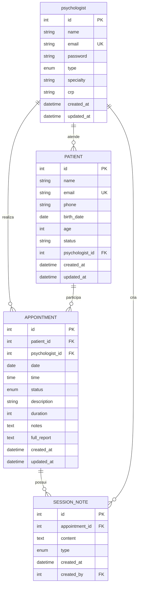

# 🗄 Modelo de Dados - Sistema Lunysse

## Visão Geral

O sistema Lunysse utiliza um modelo de dados relacional simples, atualmente implementado com localStorage para prototipagem, mas projetado para migração futura para banco de dados relacional (PostgreSQL/MySQL).

## Diagrama Entidade-Relacionamento (ER)



## Entidades Principais

### 1. USER (Usuário)

Armazena informações de psicólogos e pacientes do sistema.

```sql
CREATE TABLE users (
    id SERIAL PRIMARY KEY,
    name VARCHAR(255) NOT NULL,
    email VARCHAR(255) UNIQUE NOT NULL,
    password VARCHAR(255) NOT NULL,
    type ENUM('psicologo', 'paciente') NOT NULL,
    specialty VARCHAR(255), -- Apenas para psicólogos
    crp VARCHAR(20),        -- Apenas para psicólogos
    created_at TIMESTAMP DEFAULT CURRENT_TIMESTAMP,
    updated_at TIMESTAMP DEFAULT CURRENT_TIMESTAMP ON UPDATE CURRENT_TIMESTAMP
);
```

#### Campos
- **id**: Identificador único (Primary Key)
- **name**: Nome completo do usuário
- **email**: Email único para login
- **password**: Senha criptografada
- **type**: Tipo de usuário ('psicologo' ou 'paciente')
- **specialty**: Especialidade do psicólogo (opcional)
- **crp**: Registro profissional (opcional)
- **created_at**: Data de criação
- **updated_at**: Data da última atualização

#### Índices
```sql
CREATE INDEX idx_users_email ON users(email);
CREATE INDEX idx_users_type ON users(type);
```

### 2. PATIENT (Paciente)

Informações detalhadas dos pacientes vinculados aos psicólogos.

```sql
CREATE TABLE patients (
    id SERIAL PRIMARY KEY,
    name VARCHAR(255) NOT NULL,
    email VARCHAR(255) UNIQUE NOT NULL,
    phone VARCHAR(20),
    birth_date DATE NOT NULL,
    age INT GENERATED ALWAYS AS (YEAR(CURDATE()) - YEAR(birth_date)) STORED,
    status VARCHAR(50) DEFAULT 'Ativo',
    psychologist_id INT NOT NULL,
    created_at TIMESTAMP DEFAULT CURRENT_TIMESTAMP,
    updated_at TIMESTAMP DEFAULT CURRENT_TIMESTAMP ON UPDATE CURRENT_TIMESTAMP,
    FOREIGN KEY (psychologist_id) REFERENCES users(id) ON DELETE CASCADE
);
```

#### Campos
- **id**: Identificador único (Primary Key)
- **name**: Nome completo do paciente
- **email**: Email único do paciente
- **phone**: Telefone de contato
- **birth_date**: Data de nascimento
- **age**: Idade calculada automaticamente
- **status**: Status do tratamento
- **psychologist_id**: Referência ao psicólogo responsável (Foreign Key)
- **created_at**: Data de cadastro
- **updated_at**: Data da última atualização

#### Índices
```sql
CREATE INDEX idx_patients_psychologist ON patients(psychologist_id);
CREATE INDEX idx_patients_email ON patients(email);
CREATE INDEX idx_patients_status ON patients(status);
```

### 3. APPOINTMENT (Agendamento/Sessão)

Registra todas as sessões agendadas e realizadas.

```sql
CREATE TABLE appointments (
    id SERIAL PRIMARY KEY,
    patient_id INT NOT NULL,
    psychologist_id INT NOT NULL,
    date DATE NOT NULL,
    time TIME NOT NULL,
    status ENUM('agendado', 'concluido', 'cancelado', 'reagendado') DEFAULT 'agendado',
    description TEXT,
    duration INT DEFAULT 50, -- em minutos
    notes TEXT,
    full_report TEXT,
    created_at TIMESTAMP DEFAULT CURRENT_TIMESTAMP,
    updated_at TIMESTAMP DEFAULT CURRENT_TIMESTAMP ON UPDATE CURRENT_TIMESTAMP,
    FOREIGN KEY (patient_id) REFERENCES patients(id) ON DELETE CASCADE,
    FOREIGN KEY (psychologist_id) REFERENCES users(id) ON DELETE CASCADE,
    UNIQUE KEY unique_appointment (psychologist_id, date, time)
);
```

#### Campos
- **id**: Identificador único (Primary Key)
- **patient_id**: Referência ao paciente (Foreign Key)
- **psychologist_id**: Referência ao psicólogo (Foreign Key)
- **date**: Data da sessão
- **time**: Horário da sessão
- **status**: Status da sessão
- **description**: Descrição/objetivo da sessão
- **duration**: Duração em minutos
- **notes**: Anotações rápidas
- **full_report**: Relatório completo da sessão
- **created_at**: Data de criação
- **updated_at**: Data da última atualização

#### Índices
```sql
CREATE INDEX idx_appointments_patient ON appointments(patient_id);
CREATE INDEX idx_appointments_psychologist ON appointments(psychologist_id);
CREATE INDEX idx_appointments_date ON appointments(date);
CREATE INDEX idx_appointments_status ON appointments(status);
CREATE UNIQUE INDEX idx_appointments_unique ON appointments(psychologist_id, date, time);
```

### 4. SESSION_NOTE (Anotações de Sessão)

Anotações adicionais e observações das sessões.

```sql
CREATE TABLE session_notes (
    id SERIAL PRIMARY KEY,
    appointment_id INT NOT NULL,
    content TEXT NOT NULL,
    type ENUM('observacao', 'recomendacao', 'evolucao', 'alerta') DEFAULT 'observacao',
    created_at TIMESTAMP DEFAULT CURRENT_TIMESTAMP,
    created_by INT NOT NULL,
    FOREIGN KEY (appointment_id) REFERENCES appointments(id) ON DELETE CASCADE,
    FOREIGN KEY (created_by) REFERENCES users(id) ON DELETE CASCADE
);
```

#### Campos
- **id**: Identificador único (Primary Key)
- **appointment_id**: Referência à sessão (Foreign Key)
- **content**: Conteúdo da anotação
- **type**: Tipo de anotação
- **created_at**: Data de criação
- **created_by**: Usuário que criou a anotação (Foreign Key)

## Relacionamentos

### 1. User → Patient (1:N)
- Um psicólogo pode atender múltiplos pacientes
- Um paciente pertence a apenas um psicólogo

### 2. User → Appointment (1:N)
- Um psicólogo pode ter múltiplos agendamentos
- Um agendamento pertence a apenas um psicólogo

### 3. Patient → Appointment (1:N)
- Um paciente pode ter múltiplos agendamentos
- Um agendamento pertence a apenas um paciente

### 4. Appointment → Session_Note (1:N)
- Uma sessão pode ter múltiplas anotações
- Uma anotação pertence a apenas uma sessão

## Regras de Negócio

### Constraints e Validações

1. **Unicidade de Email**: Emails devem ser únicos no sistema
2. **Horário Único**: Um psicólogo não pode ter dois agendamentos no mesmo horário
3. **Idade Válida**: Pacientes devem ter idade entre 0 e 120 anos
4. **Status Válidos**: Apenas status predefinidos são aceitos
5. **Duração Mínima**: Sessões devem ter pelo menos 30 minutos

### Triggers e Procedures

```sql
-- Trigger para atualizar updated_at automaticamente
DELIMITER //
CREATE TRIGGER update_timestamp_users
    BEFORE UPDATE ON users
    FOR EACH ROW
BEGIN
    SET NEW.updated_at = CURRENT_TIMESTAMP;
END//

CREATE TRIGGER update_timestamp_patients
    BEFORE UPDATE ON patients
    FOR EACH ROW
BEGIN
    SET NEW.updated_at = CURRENT_TIMESTAMP;
END//

CREATE TRIGGER update_timestamp_appointments
    BEFORE UPDATE ON appointments
    FOR EACH ROW
BEGIN
    SET NEW.updated_at = CURRENT_TIMESTAMP;
END//
DELIMITER ;
```

## Queries Comuns

### 1. Buscar Pacientes de um Psicólogo
```sql
SELECT p.*, 
       COUNT(a.id) as total_sessions,
       MAX(a.date) as last_session
FROM patients p
LEFT JOIN appointments a ON p.id = a.patient_id
WHERE p.psychologist_id = ?
GROUP BY p.id
ORDER BY p.name;
```

### 2. Agenda do Psicólogo
```sql
SELECT a.*, p.name as patient_name
FROM appointments a
JOIN patients p ON a.patient_id = p.id
WHERE a.psychologist_id = ?
  AND a.date BETWEEN ? AND ?
ORDER BY a.date, a.time;
```

### 3. Horários Disponíveis
```sql
SELECT time_slot
FROM (
    SELECT '09:00' as time_slot UNION
    SELECT '10:00' UNION
    SELECT '11:00' UNION
    SELECT '14:00' UNION
    SELECT '15:00' UNION
    SELECT '16:00' UNION
    SELECT '17:00'
) slots
WHERE time_slot NOT IN (
    SELECT time
    FROM appointments
    WHERE psychologist_id = ?
      AND date = ?
      AND status = 'agendado'
);
```

### 4. Relatório de Sessões por Status
```sql
SELECT 
    status,
    COUNT(*) as total,
    ROUND(COUNT(*) * 100.0 / SUM(COUNT(*)) OVER(), 2) as percentage
FROM appointments
WHERE psychologist_id = ?
  AND date >= DATE_SUB(CURDATE(), INTERVAL 6 MONTH)
GROUP BY status;
```

### 5. Pacientes com Alertas de Risco
```sql
SELECT p.name,
       COUNT(CASE WHEN a.status = 'cancelado' THEN 1 END) as cancelamentos,
       COUNT(CASE WHEN a.status = 'concluido' THEN 1 END) as sessoes_concluidas,
       MAX(a.date) as ultima_sessao
FROM patients p
LEFT JOIN appointments a ON p.id = a.patient_id
WHERE p.psychologist_id = ?
GROUP BY p.id, p.name
HAVING cancelamentos > 2 
    OR ultima_sessao < DATE_SUB(CURDATE(), INTERVAL 30 DAY)
ORDER BY cancelamentos DESC, ultima_sessao ASC;
```

## Implementação Atual (localStorage)

### Estrutura de Dados Atual

```javascript
// lunysse_users
[{
  id: 1,
  name: "Dr. João Silva",
  email: "psicologo@test.com",
  password: "123456",
  type: "psicologo",
  specialty: "Psicologia Clínica",
  crp: "CRP 01/12345"
}]

// lunysse_patients
[{
  id: 1,
  name: "Maria Santos",
  email: "maria.santos@email.com",
  phone: "(11) 99999-1111",
  birthDate: "1990-05-15",
  age: 34,
  status: "Em tratamento",
  psychologistId: 1
}]

// lunysse_appointments
[{
  id: 1,
  patientId: 1,
  psychologistId: 1,
  date: "2024-12-20",
  time: "14:00",
  status: "agendado",
  description: "Sessão de acompanhamento",
  duration: 50,
  notes: "",
  fullReport: ""
}]
```

### Funções de Acesso aos Dados

```javascript
// Funções utilitárias para localStorage
const getStorageData = (key, defaultData) => {
  try {
    const stored = localStorage.getItem(key);
    return stored ? JSON.parse(stored) : defaultData;
  } catch {
    return defaultData;
  }
};

const setStorageData = (key, data) => {
  localStorage.setItem(key, JSON.stringify(data));
};

// Simulação de queries
const getPatientsByPsychologist = (psychologistId) => {
  const patients = getStorageData(STORAGE_KEYS.PATIENTS, []);
  const appointments = getStorageData(STORAGE_KEYS.APPOINTMENTS, []);
  
  return patients
    .filter(patient => patient.psychologistId === psychologistId)
    .map(patient => ({
      ...patient,
      totalSessions: appointments.filter(apt => apt.patientId === patient.id).length
    }));
};
```

## Migração para Banco de Dados

### Plano de Migração

1. **Fase 1**: Criação das tabelas e estrutura
2. **Fase 2**: Migração dos dados do localStorage
3. **Fase 3**: Implementação da API REST
4. **Fase 4**: Substituição das chamadas mockApi
5. **Fase 5**: Otimização e índices

### Script de Migração

```javascript
// Exemplo de script de migração
const migrateFromLocalStorage = async () => {
  const users = JSON.parse(localStorage.getItem('lunysse_users') || '[]');
  const patients = JSON.parse(localStorage.getItem('lunysse_patients') || '[]');
  const appointments = JSON.parse(localStorage.getItem('lunysse_appointments') || '[]');
  
  // Migrar usuários
  for (const user of users) {
    await api.post('/users', user);
  }
  
  // Migrar pacientes
  for (const patient of patients) {
    await api.post('/patients', patient);
  }
  
  // Migrar agendamentos
  for (const appointment of appointments) {
    await api.post('/appointments', appointment);
  }
};
```

## Backup e Recuperação

### Estratégia de Backup (Futuro)

1. **Backup Diário**: Dump completo do banco
2. **Backup Incremental**: Log de transações
3. **Replicação**: Servidor secundário
4. **Cloud Backup**: Armazenamento na nuvem

### Recuperação de Dados

```sql
-- Exemplo de procedure para recuperação
DELIMITER //
CREATE PROCEDURE backup_user_data(IN user_id INT)
BEGIN
    SELECT 'USERS' as table_name;
    SELECT * FROM users WHERE id = user_id;
    
    SELECT 'PATIENTS' as table_name;
    SELECT * FROM patients WHERE psychologist_id = user_id;
    
    SELECT 'APPOINTMENTS' as table_name;
    SELECT a.* FROM appointments a
    JOIN patients p ON a.patient_id = p.id
    WHERE p.psychologist_id = user_id;
END//
DELIMITER ;
```

## Performance e Otimização

### Índices Recomendados

```sql
-- Índices compostos para queries frequentes
CREATE INDEX idx_appointments_psych_date ON appointments(psychologist_id, date);
CREATE INDEX idx_appointments_patient_status ON appointments(patient_id, status);
CREATE INDEX idx_patients_psych_status ON patients(psychologist_id, status);
```

### Particionamento (Para Grande Volume)

```sql
-- Particionamento por data para appointments
ALTER TABLE appointments
PARTITION BY RANGE (YEAR(date)) (
    PARTITION p2023 VALUES LESS THAN (2024),
    PARTITION p2024 VALUES LESS THAN (2025),
    PARTITION p2025 VALUES LESS THAN (2026),
    PARTITION p_future VALUES LESS THAN MAXVALUE
);
```

## Conclusão

O modelo de dados do Lunysse foi projetado para ser:

- **Simples**: Estrutura clara e fácil de entender
- **Escalável**: Preparado para crescimento
- **Flexível**: Permite extensões futuras
- **Performante**: Índices otimizados para queries comuns
- **Consistente**: Regras de integridade bem definidas

Esta base sólida suporta todas as funcionalidades atuais e futuras do sistema.
